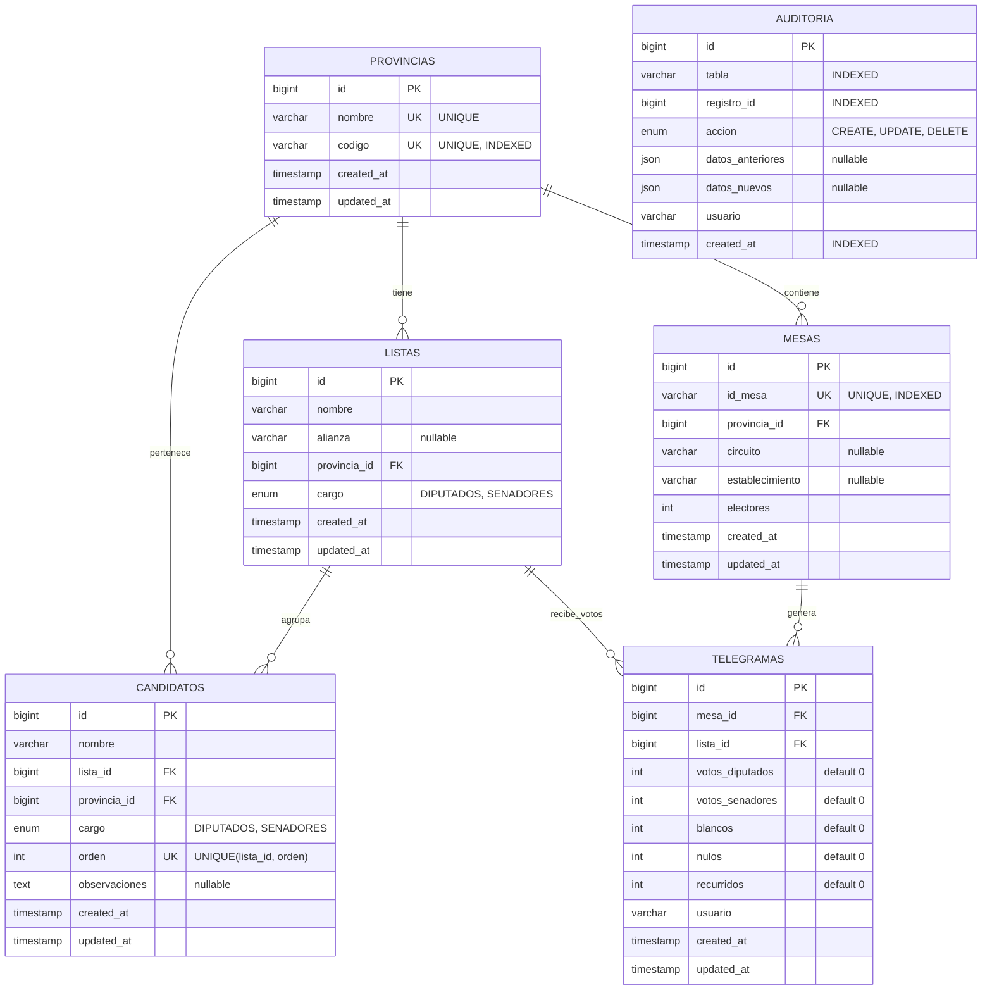

# Database Entity-Relationship Diagram

## Diagrama ER - Sistema Electoral Argentina 2025



## Relaciones y Constraints

### Foreign Keys

| Tabla | Campo | Referencia | ON DELETE | ON UPDATE | Descripción |
|-------|-------|------------|-----------|-----------|-------------|
| listas | provincia_id | provincias.id | RESTRICT | CASCADE | Una lista pertenece a una provincia |
| candidatos | lista_id | listas.id | CASCADE | CASCADE | Candidatos se eliminan con la lista |
| candidatos | provincia_id | provincias.id | RESTRICT | CASCADE | Candidato pertenece a provincia |
| mesas | provincia_id | provincias.id | RESTRICT | CASCADE | Mesa pertenece a provincia |
| telegramas | mesa_id | mesas.id | CASCADE | CASCADE | Telegrama se elimina con la mesa |
| telegramas | lista_id | listas.id | RESTRICT | CASCADE | Telegrama referencia una lista |

### Índices Únicos

| Tabla | Campos | Tipo | Descripción |
|-------|--------|------|-------------|
| provincias | codigo | UNIQUE | Código único de provincia |
| provincias | nombre | UNIQUE | Nombre único de provincia |
| listas | nombre, provincia_id, cargo | COMPOUND UNIQUE | Lista única por nombre, provincia y cargo |
| candidatos | lista_id, orden | COMPOUND UNIQUE | Orden único dentro de cada lista |
| mesas | id_mesa | UNIQUE | Identificador único de mesa |
| telegramas | mesa_id, lista_id | COMPOUND UNIQUE | Un telegrama por mesa y lista |

### Índices de Optimización

| Tabla | Campos | Tipo | Propósito |
|-------|--------|------|-----------|
| provincias | codigo | INDEX | Búsqueda rápida por código |
| listas | provincia_id, cargo | COMPOUND INDEX | Filtrado por provincia y cargo |
| candidatos | lista_id, orden | COMPOUND INDEX | Ordenamiento de candidatos |
| mesas | provincia_id, circuito | COMPOUND INDEX | Búsqueda de mesas por ubicación |
| mesas | id_mesa | INDEX | Búsqueda rápida por ID mesa |
| telegramas | mesa_id, lista_id | COMPOUND INDEX | Consultas de resultados |
| auditoria | tabla, registro_id | COMPOUND INDEX | Auditoría por tabla y registro |
| auditoria | usuario, created_at | COMPOUND INDEX | Auditoría por usuario y fecha |
| auditoria | created_at | INDEX | Consultas temporales |

## Reglas de Negocio

### Provincias
- Cada provincia tiene un código único (ej: "BA", "CABA")
- El nombre de la provincia es único en el sistema

### Listas
- Una lista pertenece a una sola provincia
- El cargo puede ser DIPUTADOS o SENADORES
- La combinación (nombre, provincia, cargo) debe ser única
- Una lista no puede eliminarse si tiene telegramas asociados (RESTRICT)

### Candidatos
- Cada candidato pertenece a una lista y una provincia
- El orden dentro de una lista debe ser único
- Al eliminar una lista, se eliminan todos sus candidatos (CASCADE)

### Mesas
- Cada mesa tiene un ID único (id_mesa)
- Una mesa pertenece a una provincia
- Las mesas no pueden eliminarse si tienen telegramas (via CASCADE en telegramas)

### Telegramas
- Representa los votos contabilizados en una mesa para una lista
- La combinación (mesa_id, lista_id) debe ser única
- Al eliminar una mesa, se eliminan sus telegramas (CASCADE)
- Al eliminar una lista, se restringe si tiene telegramas (RESTRICT)

### Auditoría
- Registra todas las operaciones CREATE, UPDATE, DELETE
- Almacena el estado anterior y nuevo en formato JSON
- Indexada por tabla, registro, usuario y fecha para consultas eficientes

## Ejemplos de Queries Comunes

### Obtener resultados de una mesa específica
```sql
SELECT l.nombre AS lista, t.votos_diputados, t.votos_senadores
FROM telegramas t
JOIN listas l ON t.lista_id = l.id
WHERE t.mesa_id = ?
ORDER BY t.votos_diputados DESC;
```

### Candidatos de una lista ordenados
```sql
SELECT c.orden, c.nombre, c.cargo
FROM candidatos c
WHERE c.lista_id = ?
ORDER BY c.orden ASC;
```

### Mesas por provincia y circuito
```sql
SELECT id_mesa, establecimiento, electores
FROM mesas
WHERE provincia_id = ? AND circuito = ?
ORDER BY id_mesa;
```

### Auditoría de cambios recientes
```sql
SELECT tabla, accion, usuario, created_at
FROM auditoria
WHERE created_at > DATE_SUB(NOW(), INTERVAL 24 HOUR)
ORDER BY created_at DESC;
```

### Total de votos por lista en una provincia
```sql
SELECT l.nombre,
       SUM(t.votos_diputados) AS total_diputados,
       SUM(t.votos_senadores) AS total_senadores
FROM telegramas t
JOIN listas l ON t.lista_id = l.id
JOIN mesas m ON t.mesa_id = m.id
WHERE m.provincia_id = ?
GROUP BY l.id, l.nombre
ORDER BY total_diputados DESC;
```
